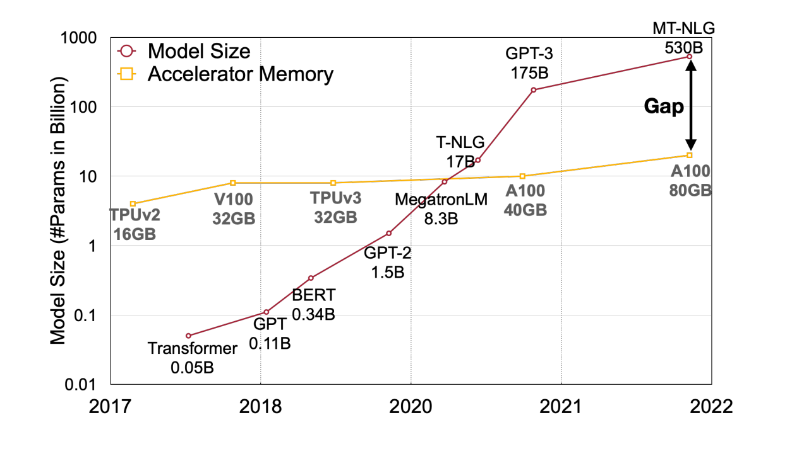

# **L1: Introduction to TinyML and Efficient Deep Learning Computing**

## Quick Reference

|Item|Reference|
|---|---|
| Slides | [View Slides](https://drive.google.com/file/d/1a3z0A1b5747HmocAbHu8kOWglX3CVkha/view)|
| Video | [Introduction to TinyML and Efficient Deep Learning Computing](http://www.youtube.com/watch?v=6cAmS-_vEh8)  |
|Lab| -- |
|Professor|[Song Han](https://github.com/songhan)|

## **1. Course Introduction and Core Motivation**

The course addresses the growing **gap between the demand for AI computing and the available hardware supply**.

### **The Problem:**

* AI model size (parameters) is growing exponentially ( $\approx 10 \times$ per year).  
* Hardware (GPU) speed is growing linearly (Moore's Law is slowing down).  
* This divergence makes state-of-the-art AI increasingly expensive, power-hungry, and difficult to deploy.

### **Key Principle:**

Compute is cheap, but memory movement/data movement is expensive.  
Much of the model efficiency is bottlenecked by memory bandwidth.

### **The Solution Focus:**

The core focus of this class is on:

1. **Model Compression and Acceleration** (Pruning, Sparsity, Quantization).  
2. **Efficient Inference Hardware and Systems** to make AI more scalable and deployable.

## **2. Applications of Efficient ML**

The lecture highlights the necessity of efficient deep learning across various domains:

### **A. Vision Models**

| Application | Challenge | Efficient ML Technique & Outcome |
| :---- | :---- | :---- |
| **Mobile AI (Image Classification, Pose Estimation)** | Limited computational power and budget on mobile devices. | **Model compression** is required to run inference locally on the phone. |
| **TinyML on Microcontrollers** | Running complex AI on low-power IoT devices (e.g., $5 microcontrollers) with only **Kilobytes of RAM**. | **MCUNet/TinyEngine** system and algorithm co-design enables applications like person detection locally. |
| **On-Device Training** | Training is more expensive than inference. Need to update models on the edge for privacy/connectivity issues. | Techniques allow training on a microcontroller with **under 256 KB of memory** (e.g., 1.7 frames per second). |
| **Vision Transformers (ViT) and SAM** | Models like Segment Anything Model (SAM) are computationally heavy, running at $\approx 12$ images/sec on a large cloud GPU. | **Efficient-ViT** accelerates Vision Transformers by **70 times** to $\approx 800$ images/sec without accuracy loss. |
| **Generative Models (Diffusion, GANs)** | Training is super costly (e.g., Stable Diffusion costs over $600K to train); inference is slow. | **GAN Compression** reduces computation by 9x to 21x. **Sparse Inference** for in-painting only generates the masked region, reducing computation by **3.6 times**. |
| **Autonomous Driving (3D Perception)** | Processing sparse Lidar Point Clouds is not hardware-friendly and is computationally expensive. Fusing multiple sensors is a challenge. | **Fast LidarNet** accelerates Lidar perception from 5 frames/sec to **47 frames/sec**. **Bird-Eye View (BEV) Fusion** allows for multi-sensor processing to fit in small hardware like NVIDIA Jetson. |

### **B. Language Models (LLMs)**

* **Computational Bottleneck:** Serving LLMs like GPT-4 can be slow and expensive, often resulting in capacity caps.  
* **Zero/Few-Shot Learning and Chain-of-Thought (CoT):** These powerful emergent effects **only become possible with really big models** (e.g., 175 billion to 540 billion parameters).

#### **Efficiency Techniques to be Covered:**

* **Token Pruning/Sparse Attention:** Removes redundant words while preserving sentiment, reducing token length (e.g., pruning a film review to just "F perfect").  
* **SmoothQuant & AWQ:** Quantization techniques to compress the model to low precision (e.g., **4-bit weight**).  
* **TinyChat Demo:** The result of these techniques is being able to deploy the **Llama 7 Billion parameter model** and run it locally on a laptop (e.g., an older MacBook Air) at a reasonable speed (30 tokens per second).

### **C. Multi-Modal Models**

* **Vision-Language Models (VLMs):** Quantizing models like Llava to **4-bit** while maintaining high accuracy is crucial for making them deployable.  
* **Robotics (Vision-Language-Action):** These models (e.g., RT-1) are slow (running at a low frequency, $\approx 3$ Hz) due to high computational cost and networking latency, making **Edge Computing** necessary for real-time control.

## **3. AI Hardware Landscape**

Modern Deep Learning is enabled by three pillars: **Algorithm, Hardware, and Large-Scale Data**. The hardware landscape is diverse:

* **Cloud AI (High Power):** Large NVIDIA GPUs (A100, H100) are very powerful (up to $\approx 1000$ TOPS for A100) but are extremely expensive (e.g., a single A100 node is $\approx \$250,000$) and consume high power (up to **700 Watts/GPU**).  
* **Mobile AI (Mid Power, Mid Memory):** Qualcomm Snapdragon, Apple Neural Engine. These are specialized hardware for AI inference, typically running around **10 Watts**.  
* **Edge AI (Mid-to-Low Power):** NVIDIA Jetson series (Nano, Orin) are used for robotics and autonomous driving, with power consumption from **10 to 60 Watts**.  
* **TinyML (Lowest Power, Lowest Memory):** Microcontrollers are very cheap (a few dollars) and extremely power efficient (units switch from Watts to **milliwatts**). Memory is in **Kilobytes**.

## **4. Course Logistics**

### **Components:**

* **23 Lectures**  
* **5 Lab Assignments** (Pruning, Quantization, NAS, LLM Compression to fit on a laptop).  
* **1 Final Project** (Proposal, Presentation, Demo, Report).  
* **No Final Exam**.

### **Prerequisites:**

* No formal prerequisite, but familiarity with **Computational Structures** (SIMD, cache, branch predictor) and **Introduction to Machine Learning** (back-propagation, SGD) is helpful.
* I curated the full of resources [here](https://drive.google.com/drive/folders/15vk9PbG5EHK5u4mML7InOAQbyuvmxnZl?usp=sharing).

### **Key Topics:**

* **Part I: Efficient Inference:** Pruning, Quantization, NAS, Knowledge Distillation.  
* **Part II: Domain-Specific Optimization:** Transformer/Attention, LLMs, ViT, Video, Point Cloud, Diffusion Models.  
* **Part III: Efficient Training:** Distributed Training (Data, Model, Pipeline Parallelism), On-Device Training.  
* **Part IV: Advanced Topics:** Quantum Machine Learning.

## References

- EfficientML.ai Course | 2023 Fall | MIT 6.5940: [ Complete course video series ](https://youtube.com/playlist?list=PL80kAHvQbh-pT4lCkDT53zT8DKmhE0idB&si=Uu00N0zKopEixhw3).
